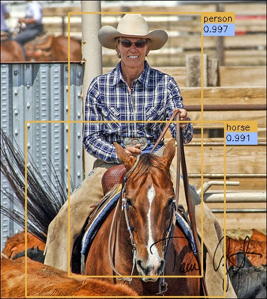
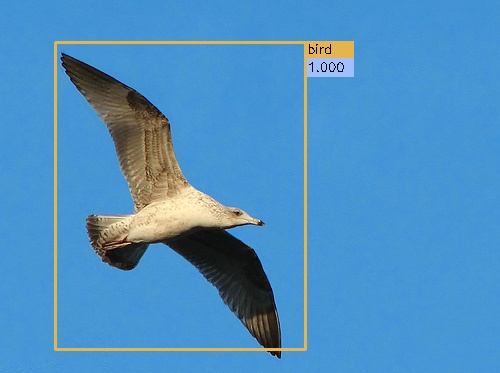

kevin.ai.faster_rcnn_pytorch_1.0_torchvision
====

A pytorch implementation of faster r-cnn, use torchvision pretrained weight.
-------

# Introduction

This project is a *faster* pytorch implementation of faster R-CNN, aimed to accelerating the training of faster R-CNN object detection models.

During our implementing, we referred many implementations, especially  [jwyang/faster-rcnn.pytorch](https://github.com/jwyang/faster-rcnn.pytorch). However, our implementation has several unique and new features compared with the above implementations:

* **It supports torchvision pretrained model**. We convert the code to use torchvision pretrained model weight in pytorch!.

* **It is memory efficient**. We use the no grad model during the demo.

* **It is support pytorch-1.0**. We change the code to run faster R-CNN in pytorch-1.0.

## Benchmarking

We benchmark our code thoroughly on pascal voc datasets, using four different network architecture: resnet18, resnet34, resnet50, resnet101. Below are the results:

1). PASCAL VOC 2007 (Train/Test: 07trainval/07test, scale=600, ROI Align)

model    | #GPUs | batch size | lr  | lr_decay | max_epoch  |  time/epoch | mem/GPU | mAP
---------|-------|------------|-----|----------|------------|-------------|---------|-----
Res-18   | 1     | 1          | 1e-3| 5        | 7          |  0.21 hr    | 1249 MB | N/A
Res-18   | 1     | 6          | 1e-3| 5        | 7          |  N/A  hr    | N/A  MB | 54.7
Res-34   | 1     | 1          | 1e-3| 5        | 7          |  N/A  hr    | N/A  MB | N/A
Res-34   | 1     | 6          | 1e-3| 5        | 7          |  0.24 hr    | 4813 MB | 67.4
Res-50   | 1     | 1          | 1e-3| 5        | 7          |  0.38 hr    | 1965 MB | 70.9
Res-50   | 1     | 6          | 1e-3| 5        | 7          |  N/A  hr    | N/A  MB | N/A 
Res-101  | 1     | 1          | 1e-3| 5        | 7          |  0.42 hr    | 3221 MB | 73.2  
Res-101  | 1     | 6          | 1e-3| 5        | 7          |  0.33 hr    | 11925MB | 69.0   

* Our pre-trained model weight can simply import via torchvision.
* If not mentioned, the GPU we used is NVIDIA Titan X Pascal (12GB).

## Preparation


First of all, clone the code
```
git clone https://github.com/kevincao91/kevin.ai.faster_rcnn_pytorch_1.0_torchvision.git
```

Then, create a folder:
```
cd kevin.ai.faster_rcnn_pytorch_1.0_torchvision && mkdir data
```

### prerequisites

* Python 3.6
* Pytorch 1.0
* CUDA 8.0 or higher

### Data Preparation

* **PASCAL_VOC 07+12**: Please follow the instructions in [py-faster-rcnn](https://github.com/rbgirshick/py-faster-rcnn#beyond-the-demo-installation-for-training-and-testing-models) to prepare VOC datasets. Actually, you can refer to any others. After downloading the data, creat softlinks in the folder data/.

### Pretrained Model

We used pytorch pretrained models in our experiments. You can download these models from:

res18
```
wget https://download.pytorch.org/models/resnet18-5c106cde.pth
```
res34
```
wget https://download.pytorch.org/models/resnet34-333f7ec4.pth
```
res50
```
wget https://download.pytorch.org/models/resnet50-19c8e357.pth
```
res101
```
wget https://download.pytorch.org/models/resnet101-5d3b4d8f.pth
```
res151
```
wget https://download.pytorch.org/models/resnet152-b121ed2d.pth
```
download the pretrained resnet models and place it under data/pretrained_model. Only ones you will use are required.

### Compilation

Install all the python dependencies using pip:
```
pip install -r requirements.txt
```

Compile the cuda dependencies using following simple commands:

```
cd lib
python setup.py build develop
```

It will compile all the modules you need, including NMS, ROI_Pooing, ROI_Align and ROI_Crop. The default version is compiled with Python 2.7, please compile by yourself if you are using a different python version.

**As pointed out in this [issue](https://github.com/jwyang/faster-rcnn.pytorch/issues/16), if you encounter some error during the compilation, you might miss to export the CUDA paths to your environment.**

## Train

Before training, set the right directory to save and load the trained models. Change the arguments "save_dir" and "load_dir" in trainval_net.py and test_net.py to adapt to your environment.

To train a faster R-CNN model with resnet50 on pascal_voc, simply run:
```
CUDA_VISIBLE_DEVICES=$GPU_ID python trainval_net.py \
                   --dataset pascal_voc --net res50 \
                   --bs $BATCH_SIZE --nw $WORKER_NUMBER \
                   --lr $LEARNING_RATE --lr_decay_step $DECAY_STEP \
                   --cuda
```
where 'bs' is the batch size with default 1. Alternatively, to train with resnet101 on pascal_voc, simple run:
```
 CUDA_VISIBLE_DEVICES=$GPU_ID python trainval_net.py \
                    --dataset pascal_voc --net res101 \
                    --bs $BATCH_SIZE --nw $WORKER_NUMBER \
                    --lr $LEARNING_RATE --lr_decay_step $DECAY_STEP \
                    --cuda
```
Above, BATCH_SIZE and WORKER_NUMBER can be set adaptively according to your GPU memory size. **On Titan Xp with 12G memory, it can be up to 6**.

If you have multiple (say 8) Titan Xp GPUs, then just use them all! Try:
```
python trainval_net.py --dataset pascal_voc --net res101 \
                       --bs 24 --nw 8 \
                       --lr $LEARNING_RATE --lr_decay_step $DECAY_STEP \
                       --cuda --mGPUs

```

Change dataset to "coco" or 'vg' if you want to train on COCO or Visual Genome.

## Test

If you want to evlauate the detection performance of a pre-trained resnet101 model on pascal_voc test set, simply run
```
python test_net.py --dataset pascal_voc --net res101 \
                   --checksession $SESSION --checkepoch $EPOCH --checkpoint $CHECKPOINT \
                   --cuda
```
Specify the specific model session, chechepoch and checkpoint, e.g., SESSION=1, EPOCH=6, CHECKPOINT=416.

## Demo

If you want to run detection on your own images with a pre-trained model, download the pretrained model listed in above tables or train your own models at first, then add images to folder $ROOT/images, and then run
```
python demo.py --net res101 \
               --checksession $SESSION --checkepoch $EPOCH --checkpoint $CHECKPOINT \
               --cuda --load_dir path/to/model/directoy
```

Then you will find the detection results in folder $ROOT/images.

**Note the default demo.py merely support pascal_voc categories. You need to change the [line](https://github.com/jwyang/faster-rcnn.pytorch/blob/530f3fdccaa60d05fa068bc2148695211586bd88/demo.py#L156) to adapt your own model.**

Below are some detection results:

<div style="color:#0000FF" align="center">
 
</div>

## Webcam Demo

You can use a webcam in a real-time demo by running
```
python demo.py --net vgg16 \
               --checksession $SESSION --checkepoch $EPOCH --checkpoint $CHECKPOINT \
               --cuda --load_dir path/to/model/directoy \
               --webcam $WEBCAM_ID
```
The demo is stopped by clicking the image window and then pressing the 'q' key.

## Authorship

TODO

## Citation

TODO
